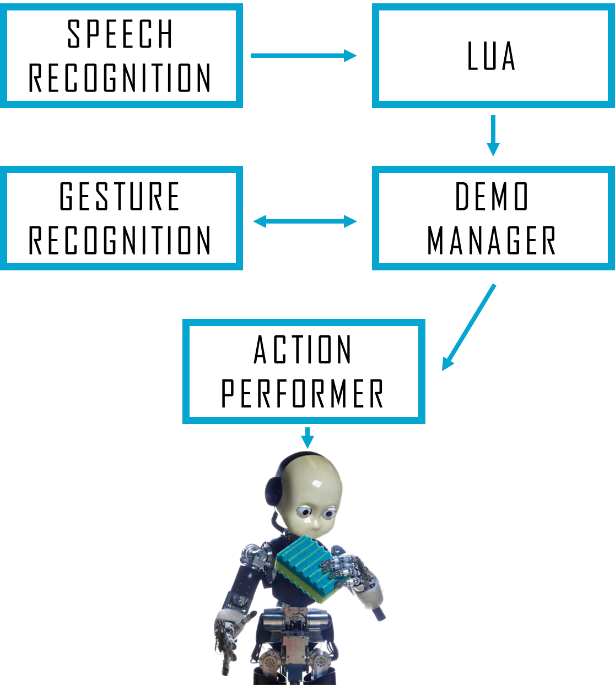

gestureRecognition
==================

This package contains modules that deal with gesture recognition using Kinect (or Asus Xtion) sensors. The gestureRecognition module implements a method to recognize a pool of gestures from a predefined set (examples of such gestures can be found in app/conf/supported_actions_easy.jpg or app/conf/supported_actions_hard.jpg). It is independent on the device and the operating system that is being used. Indeed, the KinectWrapper library provides an interface that deals with different devices and operating systems. The modules inside the game folder realizes, together with the gestureRecognition one, the memory game called All gestures you can (https://www.youtube.com/watch?v=U_JLoe_fT3I&list=UUXBFWo4IQFkSJBfqdNrE1cA).

## Installation

##### Dependencies
- [YARP](https://github.com/robotology/yarp)
- [icub-contrib-common](https://github.com/robotology/icub-contrib-common)
- [KinectWrapper](https://github.com/robotology-playground/kinectWrapper.git)

##### Cmaking the project
The project is composed of three modules. The gestureRecognition module can be used independently on the others. 

##### Running the gestureRecognition module
In order to utilize this module, a KinectServer module (in https://github.com/robotology-playground/kinectWrapper.git) has to be running.

## Architecture of the game

The game is structured in turns. One of the two players (the person or the robot) has to start performing a gesture. Then, the opponent recognizes the gesture, replicates it and adds a second random gesture to the sequence (from the pool of the possible gestures). At this point, the other player replicates the two gestures in the sequence, and adds a third gesture. This procedure is carried on until one of the two players loses.

The entire architecture can be run from the script files. First, the dependencies have to be launched (app/scripts/demoGestureRecognitionDependencies.xml), then the main modules (app/scripts/demoGestureRecognition.xml). Finally, the file app/scripts/demoRec_main.lua has to be run. 

The main purpose of this YARP wrapper is to abstract from the hardware and provide data neatly and effectively over the network. The resulting gains are threefold: (1) the benefit in controlling the bandwidth while preventing data duplication; (2) the significant facilitation from user standpoint of writing code by means of proxy access to the hardware, with resort to a standard set of YARP API in place of direct calls to a custom set of Kinect API; (3) the possibility to easily scale up with the addition of new modules accessing the device.

The _Kinect Wrapper_ has been designed and implemented adhering to the client-server paradigm, where the server (i.e. `KinectServer`) takes care of streaming out all the information over YARP ports and the clients (i.e. `KinectClient`) are light YARP front-end instantiated within the user code that read Kinect data from the network and provide them in a convenient format.
To further separate the driver interfacing the Kinect device from the part of the sever dealing with YARP communication, a third abstraction layer has been considered, namely the `KinectDriver`, and located at lowest level in the wrapper hierarchy with the requirement of providing the `KinectServer` with the Kinect raw data to be marshaled and sent over the network. The `KinectDriver` is thus specialized in two implementations: the `KinectDriverSDK` and the `KinectDriverOpenNI`, respectively.

The hierarchical structure of the wrapper can be seen in the following diagram:

In particular, the `KinectServer` is realized as a periodic thread that initially opens the Kinect device using either the `KinectDriverSDK` or the `KinectDriverOpenNI` components; then, at each run, the server reads the information as configured by the user from the driver (depth data only, user skeleton only, RGB images only or combination of them) and sends them over YARP ports. On the client side, the user relies on a set of simple function calls to retrieve such information.

## License

Material included here is Copyright of _Istituto Italiano di Tecnologia_ and _EFAA Consortium_. kinectWrapper is released under the terms of the GPL v2.0 or later. See the file LICENSE for details.
